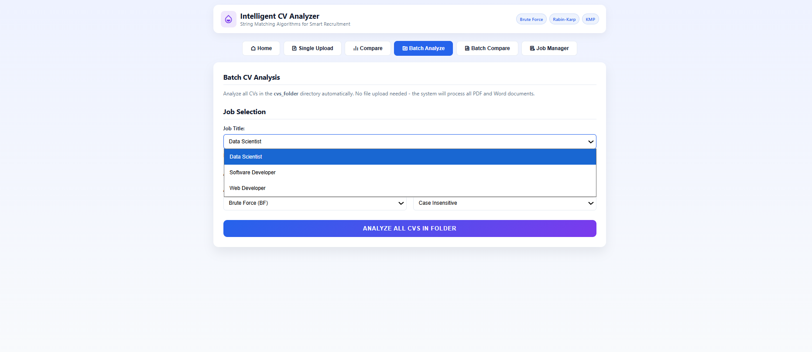
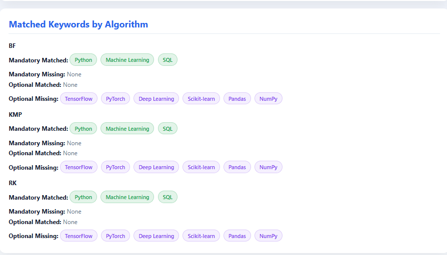
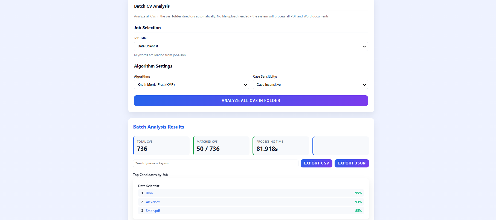
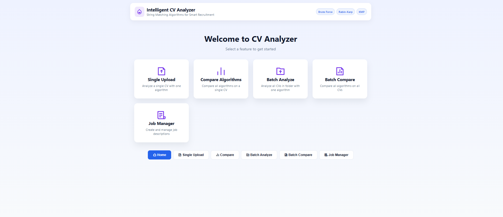

# CV Analyzer Web Application

A modern web application for analyzing CVs against job descriptions using three string matching algorithms: Brute Force, Knuth-Morris-Pratt (KMP), and Rabin-Karp.

## Features

- 📄 Upload and analyze CVs in PDF, DOCX, DOC, and TXT formats
- 🔍 Search using three different string matching algorithms
- 📊 Compare algorithm performance metrics
- 🎯 Relevance scoring based on mandatory and optional keywords
- 📈 Detailed performance metrics (comparisons, time, collisions)
- 🎨 Modern, responsive UI with drag-and-drop file upload

## Web App Preview






## Installation

1. Install Python dependencies:
```bash
pip install -r requirements.txt
```

2. Create the uploads directory:
```bash
mkdir uploads
```

## Running the Application

### Quick Start

1. **Install dependencies:**
```bash
pip install -r requirements.txt
```

2. **Start the Flask server:**
```bash
python app.py
```

3. **Open your browser:**
```
http://localhost:5000
```

The Flask development server will start on port 5000. Open the URL in your browser to use the web interface.

## Usage

1. **Single Algorithm Mode:**
   - Upload a CV file
   - Enter mandatory and optional keywords
   - Select an algorithm (BF, KMP, or RK)
   - Choose case sensitivity setting
   - Click "Analyze CV"
   
2. **Compare All Algorithms:**
   - Upload a CV file
   - Enter mandatory and optional keywords
   - Choose case sensitivity setting
   - Click "Compare All Algorithms"
   - View performance comparison of all three algorithms

## API Endpoints

### POST `/api/analyze`
Analyze a CV with a single algorithm.

**Parameters:**
- `cv` (file): CV file to upload
- `job_data` (JSON): Job keywords in format `{"job_name": {"mandatory": [], "optional": []}}`
- `algorithm` (string): Algorithm to use (bf, kmp, rk)
- `case_sensitive` (boolean): Case sensitivity setting

### POST `/api/compare`
Compare all algorithms on a single CV.

**Parameters:**
- `cv` (file): CV file to upload
- `job_data` (JSON): Job keywords
- `case_sensitive` (boolean): Case sensitivity setting

## Algorithms

- **Brute Force (BF):** Simple string matching with O(n*m) complexity
- **Knuth-Morris-Pratt (KMP):** Efficient pattern matching with O(n+m) complexity
- **Rabin-Karp (RK):** Hash-based string matching with collision detection

## Project Structure

```
assignment2/
├── app.py                 # Flask backend application
├── cv_analyzer.py        # Core CV analysis algorithms
├── index.html            # Frontend HTML
├── style.css             # Frontend styling
├── script.js             # Frontend JavaScript
├── requirements.txt      # Python dependencies
├── jobs.json             # Example job descriptions
├── .gitignore            # Git ignore file
├── README.md             # This file
└── uploads/              # Temporary file uploads (created automatically)
```

## Command Line Usage

The original command-line interface is still available:

```bash
python cv_analyzer.py --cvs ./cvs_folder --jobs jobs.json --out results
```

## Technologies

- **Backend:** Flask, Python
- **Frontend:** HTML5, CSS3, JavaScript
- **Algorithms:** Brute Force, KMP, Rabin-Karp
- **Text Processing:** pdfminer, python-docx
- **Visualization:** Matplotlib, Pandas

